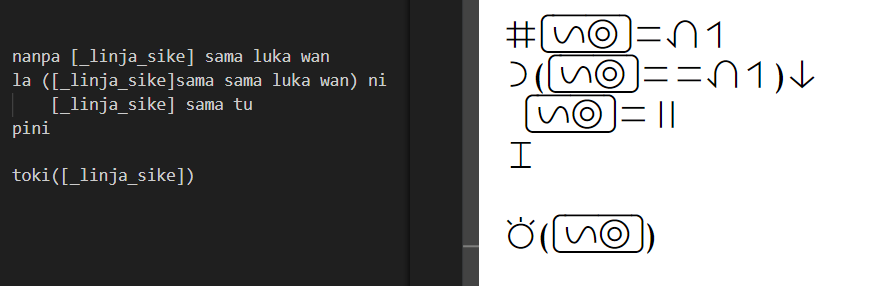

# tokiPonaProgramming

What is toki pona?
- 
toki pona (always written in lowecase) is a conlang (constructed language) created by Sonja Lang, and is known for its small vocabulary and general simplicity. It has around 130 words, no conjugations/declensions or gender and every word can be either a noun, a verb or an adjective depending on context. Its numbering system is also super simple, similar to the roman numerals.

It was chosen to be used in this programming language because i think its a fun challenge to translate 'harder' concepts such as multiplication and if/elses into such a simple language, and also its appearence when using the logography. By the way, this is how you say 'toki pona' in toki pona:

How does it look like?
- 
There are two ways to view this language, the first one is using the romanization, and the second one is using toki pona's logography. Both can be seen below:

